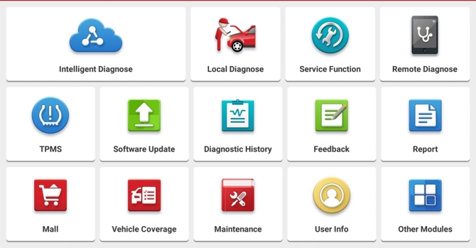

# Brief
## What is this file?
This file covers all Golo365 API documentation discovered to-date. It outlines the various components of their multitude of APIs and endpoints. Moreover, it briefly covers the greedy marketing techniques employed by companies who sell the Launch Tech LTD. diagnostic equipment.

## What is Golo365?
Golo365 is the underlying data connection service behind many automotive diagnostic computers and equipment. Device manufacturers, such as Launch Tech LTD and Matco Tools rely on them for various services. The goal of this API wrapper is to simplify access to Golo365's *extremely undocumented* API endpoints, and to allow for independent individuals or companies to integrate critical data connections between Golo365 and their own proprietary services.

## What is Launch LTD?
Launch Tech (aka Launch, aka Launch Tech Co. LTD, aka Launch USA, etc) is a single organization that markets their automotive diagnostic equipment under different brands.

## What is the MATCO Maximus?
The MATCO Maximus (3.0, 4.0, etc) diagnostic tablet is a Launch Tech LTD. device that's rebranded and sold at a **huge** markup (often $5,000USD or above). The Maximus product line is not akin to Snap-On or Autel in their product development; these are not products produced by MATCO. Do not be fooled.

## Am I in the right place?
If you're unsure whether this document will be useful to you, then compare your current situation to the following scenarios.

### Related Domains

If any of the following domains look familiar to you, then you're in the right place.

- https://www.golo365.com/
- https://www.launchtechusa.com/
- http://x431.com
- http://api.dbscar.com/
- http://dbscar.com/
- http://ait.golo365.com
- http://aitus.golo365.com
- https://api.mythinkcar.com/
- http://aws.golo365.com/

### Related Auto Diagnostic Equipment

If you're familiar with, or using any diagnostic equipment, or anything akin to it, you're in the right place.
- [MATCO MAXIMUS 4.0 TABLET](https://www.matcotools.com/catalog/product/MDMAX4CL/MAXIMUS-4-0-TABLET-WITH-PASSENGER-CAR-SOFTWARE/)
- [Launch Gear Scan Plus Diagnostic Tool](https://www.bestbuyautoequipment.com/launch-gear-scan-plus-diagnostic-tool-p/301050458.htm)
- [Launch X-431 Torque 3](https://www.launchtechusa.com/product-page/x431-torqueiii)
- [Launch X-431 V+ Pro](https://www.amazon.com/gp/product/B00NID586M)
- ... Basically anything from Launch, even if it's rebranded (like the MATCO tools)

If your diagnostic scanner (or the Android app) has a "Home" page that looks similar to below, your data is probably being synced with Golo / Golo365 / AIT.



### Diagnostic Report/Record Examples
If your diagnostic tool generates a report that looks like these, you're definitely in the right place:
- http://aitus.golo365.com/report/think_car/?id=14025fbfjq8cKwTd8cOM5454&type=diag&lan=en-us
- http://reportview.thinkcar.com/report/think_car/?id=e4a79e73jq1uKwtZtZTdLrnR&type=diag&lan=en-us
- http://aws.ithinkcar.com/Home/Index/shareReportNew?id=e598545djq8cTdAEnR2YOMoG&type=diag&lan=en-us
- http://aitus.golo365.com/Home/Report/reportDetail/diagnose_record_id/{ID_NUM_HERE}/report_type/X/timezone/0/l/en-us

## Contributions
Many days of research and development went into discovering these entirely undocumented API endpoints. If you have an unlisted Golo365 endpoint, or know something that isn't listed here, please reach out via a GitHub Issue or Pull Request.

___

# Common Variables

## Serial Number
Although `serial_no` is not a required field for most fetching-type endpoints, this field refers to the serial number assigned to the Launch Tech device. This value is provided when you purchase the device, and is an important reference for when you submit a report event to Golo365. The exact specifications are unknown, but they appear to be 12 digits long.

*Know something else about this field? Submit a Issue.*

## Report Types
Throughout the scope of the API, the term `report_type` will appear. The `report_type` corresponds to the device that produces the report, and consists of ~2 characters. See the table below.

|Type|Description|Generating Device(s)|Example|
|:-:|:-|:-|:-:|
|`A`|Full Vehicle Systems AI Inspection Report|LaunchTech Roxy|[Example](http://aitus.golo365.com/Home/Report/reportDetail/diagnose_record_id/6f822c280C3b1u3bDh/report_type/A/timezone/0/l/en-us)|
|`D`|Inspection Report|*unknown*|[Example](http://aitus.golo365.com/Home/Report/reportDetail/diagnose_record_id/b3ec8787jq54nR54nRKw2YTd/report_type/D/l/en-us)|
|`E`|Vehicle EZ Diag Report|*unknown*|[Example](http://aitus.golo365.com/Home/Report/reportDetail/diagnose_record_id/4112bb39ge1u8ctZnRAEnRoG54/report_type/E/l/en-us)|
|`X`|Vehicle Fault Diagnostic Report|X-431, Any X-Series Launch device|[Example](http://aitus.golo365.com/Home/Report/reportDetail/diagnose_record_id/8ca37750jqtZ54AEOMtZ2YIF/report_type/X/l/en-us)|
|`TC`|ThinkCar|*unknown*|[Example](http://aitus.golo365.com/Home/ThinkCar/reportDetail/diagnose_record_id/279bd55fsa1u1u3bnRTd/report_type/TC/l/en-us)|

*Know something else about this field? Submit a Issue.*

___

# API

## URLs
The Golo365 service relies on the following URLs.

|URL|Description|Notes|
|:-|:-|:-|
|http://aitus.golo365.com/|Service URL for US based customers. By default, Launch Tech USA diagnostic devices rely on this URL.||
|http://ait.golo365.com/|Service URL for all non-US customers.||

### Note
1. The service data does **NOT** sync across subdomains. i.e. reports submitted to http://aitus.golo365.com will not be available via the http://ait.golo365.com service.

## Conventions
Unless specifically states within the scope of an endpoint, all endpoints meet the following expectation:
1. Respond only to HTTP POST requests
2. Accept only `x-www-form-urlencoded` post body
3. Return a JSON response
4. The JSON response contains a field `code` which holds the value of `0` for successful requests

## Endpoints

### Home/HttApi/reportDetail

This endpoint provides enhanced details about a particular report.

#### Arguments

|Key|Value Type|Example|
|:-|:-|:-|
|`diagnose_record_id`|int|`1920391`|
|`report_type`|string|`X`|

#### Success Example Call
```JSON
{
  "code": 0,
  "msg": "获取详情成功",
  "data": {
    "system_list": [
      {
        "system_uid": "00000076",
        "system": "SCCM (Steering Column Control Module)",
        "name_id": "2601105D",
        "is_new_sys": "0"
      },
      {
        "system_uid": "00001041",
        "system": "PCM (Powertrain Control Module)",
        "name_id": "26011011",
        "is_new_sys": "0"
      }
    ],
    "softpackageid": "DODGE",
    "vin": "1C6RR7MT8FS774785",
    "SN": "985198903500",
    "diagnose_soft_ver": "V32.00",
    "language": "EN"
  }
}
```

### Home/Index/getVinByplateNum

Fetch a VIN number by license plate number.

#### Arguments

|Key|Value Type|Example|
|:-|:-|:-|
|`plate_number`|string|`123456`|

#### Success Example Call
```JSON
{
    "code": 0,
    "data": {
        "plate_number": "123456",
        "vin": "SALAN2V60GA811146"
    }
}
```

#### Note
1. This relies on user-provided data provided during a new event report (i.e. diagnostic scan), and is not collected through a government source.

### Home/HttApi/getPlateByVin

This returns a license plate number by vehicle VIN

#### Arguments

|Key|Value Type|Example|
|:-|:-|:-|
|`vin`|string|`SALAN2V60GA811146`|

#### Success Example Call
```JSON
{
    "code": 0,
    "msg": "车辆信息查询成功！",
    "data": {
        "vehicle_id": "220",
        "user_id": "1030",
        "vehicle_name": null,
        "car_brand": "",
        "vin": "SALAN2V60GA811146",
        "engine": null,
        "cylinders": null,
        "camshaft": null,
        "cvn": null,
        "plate_number": "桂B030C8",
        "plate_number_image": null,
        "status": "0",
        "software_id": "LANDROVER",
        "diagnose_model_file_id": "0",
        "models": "Discovery4 [发现4]",
        "model_years": "2016"
    }
}
```

### Home/HttApi/reportList

This returns a collection of report records by VIN or license plate.

#### Arguments

|Key|Value Type|Example|Notes|
|:-|:-|:-|:-|
|`vin`|string|`SALAN2V60GA811146`||
|OR|
|`plate_number`|string|`123456`||
|`cvn`|*unknown*|||
|`serial_number`|string|*See Variables section*|
|`diagnose_type`|int|`3`|diagnostic event type|
|`size`|int|`5`|pagination per-page limit|
|`page`|int|`1`|pagination page #|

#### Success Example Call
```JSON
{
    "code": 0,
    "msg": "Operation succeed!",
    "data": [],
    "total_number": 0,
    "is_full_scan": 0,
    "system_list": []
}
```