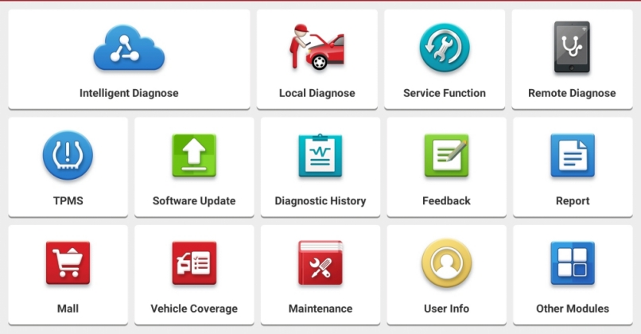

# Introduction
## What is Golo365
Golo365 is the underlying service behind many automotive diagnostic computers and equipment. Device manufacturers, such as Launch Tech LTD and Matco Tools rely on them for various services. The goal of this API wrapper is to simplify access to Golo365's *extremely undocumented* API endpoints, and to allow for independent individuals or companies to integrate critical data connections between Golo365 and their proprietary services.

## How can I use this wrapper
Here are some ways you can use this API wrapper to facilitate a connection between your service (e.g. a Shop Management System) and Golo365:
- Fetch Diagnostic Scan History reports by License Plate or VIN numbers
- Perform a VIN-to-License plate decode
- Perform a License-to-VIN decode
- ... More integrations coming soon

## Am I in the right place
### Related Domains

If any of the following domains look familiar to you, then you're probably in the right place.
- https://www.golo365.com/
- https://www.launchtechusa.com/
- http://x431.com
- http://api.dbscar.com/
- http://dbscar.com/
- http://ait.golo365.com
- http://aitus.golo365.com

### Related Auto Diagnostic Equipment

Or, if your shop is using any of the following tools, you're probably in the right place:
- [MATCO MAXIMUS 4.0 TABLET](https://www.matcotools.com/catalog/product/MDMAX4CL/MAXIMUS-4-0-TABLET-WITH-PASSENGER-CAR-SOFTWARE/)
- [Launch Gear Scan Plus Diagnostic Tool](https://www.bestbuyautoequipment.com/launch-gear-scan-plus-diagnostic-tool-p/301050458.htm)
- [Launch X-431 Torque 3](https://www.launchtechusa.com/product-page/x431-torqueiii)
- [Launch X-431 V+ Pro](https://www.amazon.com/gp/product/B00NID586M)
- ... Basically anything from Launch, even if it's rebranded (like the MATCO tools)

If your diagnostic scanner (or the Android app) has a "Home" page that looks similar to below, your data is probably being synced with Golo / Golo365 / AIT.



## Contributions
Many hours of research and development went into discovering these entirely undocumented API endpoints. If you have an unlisted Golo365 endpoint, or know something that isn't listed here, please reach out via a GitHub Issue or Pull Request.

___

# Usage
## __construct
The class constructor takes only optional arguments.

```PHP
/**
 * Class Constructor
 *
 * @param  ?string $serial_no reporting device serial number
 * @param  ?string $service Golo365 service ait|aitus
 * @author Alec M.
 * @since  1.0.0
 */
public function __construct(string $serial_no = "", string $service = "aitus")
```

If a reporting device `serial_no` is provided, any search/reporting queries that use the optional `serial_no` argument will be provided with this serial number. See the variable documentation in the class for notes on what this argument is.

The `service` argument defines which Golo365 service to report/receive data from. If your diagnostic tablet is built for the U.S., it's likely that all of your device-generated reports will reside within the AITUS service.

## setSerialNo
This function returns the class instance, which enables function call chaining.

```PHP
/**
 * Set or Remove the Device Serial Number
 *
 * @param  ?string $serial_no
 * @return self
 * @since  1.0.0
 */
public function setSerialNo(string $serial_no = "") : self
```

An empty or invalid `serial_no` argument will result in the `serial_no` being returned to the default.

## setListSize
For the API endpoints that support pagination, this specifies the number of results per page. This function supports chaining.

```PHP
/**
 * Set or Remove the Report Listing Size Limit
 *
 * @param  ?integer $size
 * @return self
 * @since  1.0.0
 */
public function setListSize(int $size = 0) : self
```

A `size` of 0 or below results in the removal of a size pagination limitation.

## reportListByVIN
This function fetches all reported diagnostic events for the provided VIN.

```PHP
/**
 * Fetch Diagnostic Scan History by VIN
 *
 * Note:
 * (1) If the serial_no variable is not empty,
 *     it will be used to limit results to that
 *     specific device
 *
 * @param  string $vin VIN to search
 * @param  mixed $page page number to fetch
 * @return Array of diagnostic scan history
 * @throws \TypeError
 * @throws \InvalidArgumentException
 * @since  1.0.0
 */
public function reportListByVIN(string $VIN, $page = "") : array
```

### Output
```PHP
Array
(
  [0] => Array
  (
    [record_id] => int
    [serial_no] => int
    [date] => 1644710448
    [VIN] => string
    [plate_number] => string
    [url] => string
    [type] => string
  )

  // ...

)
```

## reportListByPlateNumber
```PHP
/**
 * Fetch Diagnostic Scan History by License Plate Number
 *
 * Note:
 * (1) If the serial_no variable is not empty,
 *     it will be used to limit results to that
 *     specific device
 *
 * @param  string $plate_number License Plate # to search
 * @param  mixed $page page number to fetch
 * @return Array of diagnostic scan history
 * @throws \TypeError
 * @throws \InvalidArgumentException
 * @since  1.0.0
 */
public function reportListByPlateNumber(string $plate_number, $page = "") : array
```

### Output
```PHP
Array
(
  [0] => Array
  (
    [record_id] => int
    [serial_no] => int
    [date] => 1644710448
    [VIN] => string
    [plate_number] => string
    [url] => string
    [type] => string
  )

  // ...

)
```

### Notes
- The reliability of this function is dependent on end-users reporting the License Plate Number during the diagnostic session. If this was not done, those results will not be included in the return value. **If possible, use `reportListByVIN` instead**.

___

# To-Do
- getPlateByVIN
- getVINByPlateNumber
- upload_report_data
- upload_accessory_info
- mergeMultiReport

___

# Requirements & Dependencies
- PHP7+
- cURL Extension

